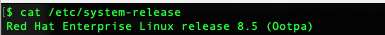

= Linux Commands Cheat Sheet
:experimental: true
:product-name:
:version: 1.0.0

Easy to use Linux shortcuts for developers organized according to category

== console and output management

=== cat

`cat <path/to/filename>` Displays the contents of `<path/to/filename>` to standard out

`cat | more` Displays the contents of the file with forward paging

=== clear

Clear the terminal screen

=== echo

=== top

== environment variables

=== env

=== export

=== source

== file and directory management

=== cd

=== cp

=== find

=== grep

=== head

=== less

=== ls

=== mkdir

=== more

=== mv

=== pwd

=== rm

=== tar

== help

=== man

== network

=== curl

=== ip

=== netstat

=== ssh

Secure shell, an encrypted network protocol allowing for remote login and command execution

On Windows: PuTTY and WinSCP

An “ssh.exe” is also available via Cygwin as well as with a Git installation.

=== wget

== process management

=== &

=== kill

=== ps

=== which

== system control

=== poweroff

=== restart

== user management

=== whomai